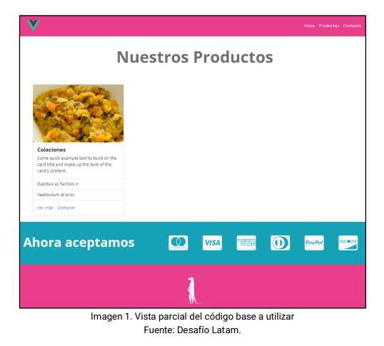

# Desafío Vue - Router

💡 Realizado [cristiandpto23](https://github.com/cristiandpto23) con HTML y JS 
➡ Front-End G17 - Desafío Latam 
🔗 Desplegado en Vercel [aquí](https://desafio-vue-router-sigma.vercel.app/) 

En este desafío validaremos nuestros conocimientos de Vue Router, implementando la navegación de una interfaz web utilizando Vue Router para dar solución a un requerimiento.

## Descripción

Aplicando los conocimientos adquiridos hasta el momento, te solicitamos realizar el siguiente desafío que consiste en hacer funcionar un menú de navegación de una interfaz web utilizando Vue Router para dar solución a una problemática.

### Indicaciones generales.

1. Usa el código base original para la solución.
2. Descárgalo, abre la carpeta con el editor de código y corre el comando npm install.
3. Aplica el uso de Vue Router para **hacer funcionar únicamente la barra de navegación**.
4. Crear las vistas correspondientes a los ítems que posee la barra de navegación.

Para lograrlo nos entregan una vista parcial del código base:

A partir de estas indicaciones generales, deberás tomar en cuenta que el código base ya posee una estructura distribuida de la siguiente manera:

-   Existe componente para el Navbar, otro para Card, Footer y Medios de pago.
-   Todo está distribuido en componentes en el código base.

## Requerimientos

1. Modificar el código del menú de navegación en sus ítems e integrar el <router-link>.
2. Generar las rutas que se requieran según los ítems ya establecidos en el menú de navegación. Estas rutas van a cargar los componentes a través de carga controlada o lazy load.
3. Generar las vistas en su respectivo directorio para que las rutas definidas tengan funcionalidad y muestren información.
4. En la vista Productos y Contacto deberá haber un enlace de redirección al inicio del sitio.
5. En la vista de Produtos.vue se recibirán props enviados desde la definición de la ruta logrando la siguiente visualización:

Nota: las props a enviar pueden ser nombre, descripción, precio y cantidad.

## Tecnologías usadas

     

-   _incluye Vue-Router_
